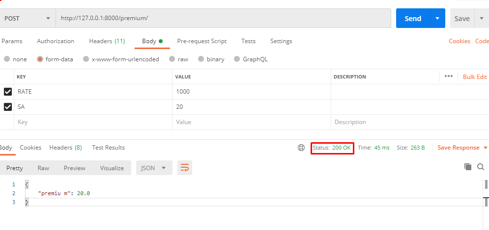
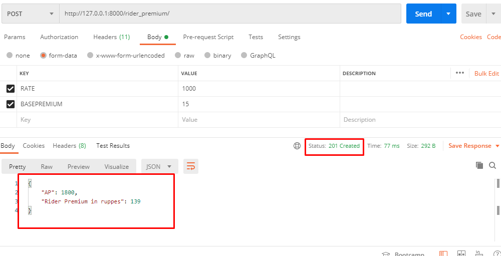

# django_rest_api_function_based_view_without_database.
Django Rest API  function based views and Without Database

### We calling API POST request for calculating premium and rider_premium
### Run project http://127.0.0.1:8000/premium/ & http://127.0.0.1:8000/riderpremium/
-----------------------------------------------------------------------------------------
Premium API DATA From POSTMAN

-----------------------------------------------------------------------------------------
Rider Premium API DATA From POSTMAN

